# Versões Executivas - POC GOL + Zoom Contact Center
**Visualizações Estratégicas para Liderança Executiva GOL**

## 🎯 Visão Estratégica da POC

### 📊 Transformação em 21 Dias
- **Duração da POC**: 21 dias úteis (03/09 a 23/09/2025)
- **Escopo**: 50 usuários (40 agentes + 10 supervisores)
- **Objetivo**: Validar Centro de Excelência do Cliente
- **Meta**: Baseline para ROI 261% (estudo Forrester TEI)

---

## 🔄 1. Fluxo da POC Simplificado

```mermaid
graph LR
    A[📞 Cliente Liga GOL] --> B[🤖 Zoom Contact Center]
    B --> C[🔍 Zendesk Integration]
    C --> D[👁️ Screen Pop Automático]
    
    D --> E[👥 Agente Atende]
    E --> F[🧠 Expert Assist IA]
    F --> G[📋 Sugestões Contextuais]
    G --> H[✅ Resolução Eficaz]
    
    H --> I[📝 Ticket Automático]
    I --> J[📊 Métricas Coletadas]
    J --> K[💰 Business Case]
    
    style B fill:#f3e5f5
    style F fill:#f3e5f5
    style K fill:#c8e6c9
```

**Resultado POC**: Evidências para transformação completa do contact center GOL.

---

## 💰 2. Business Case da POC

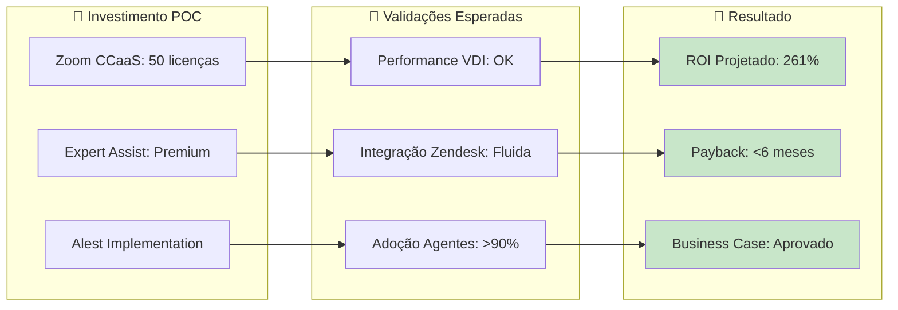

**Bottom Line POC**: Validar que cada R$ 1 investido retornará R$ 2,61 em produção.

### 💎 Fluxo de Valor da POC

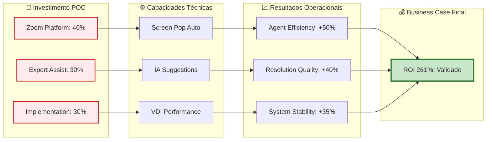

### 🎯 Radar de Validação POC

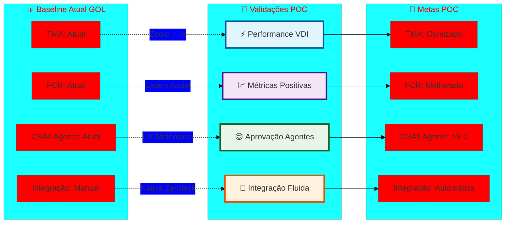

---

## 🏗️ 3. Arquitetura POC Alto Nível

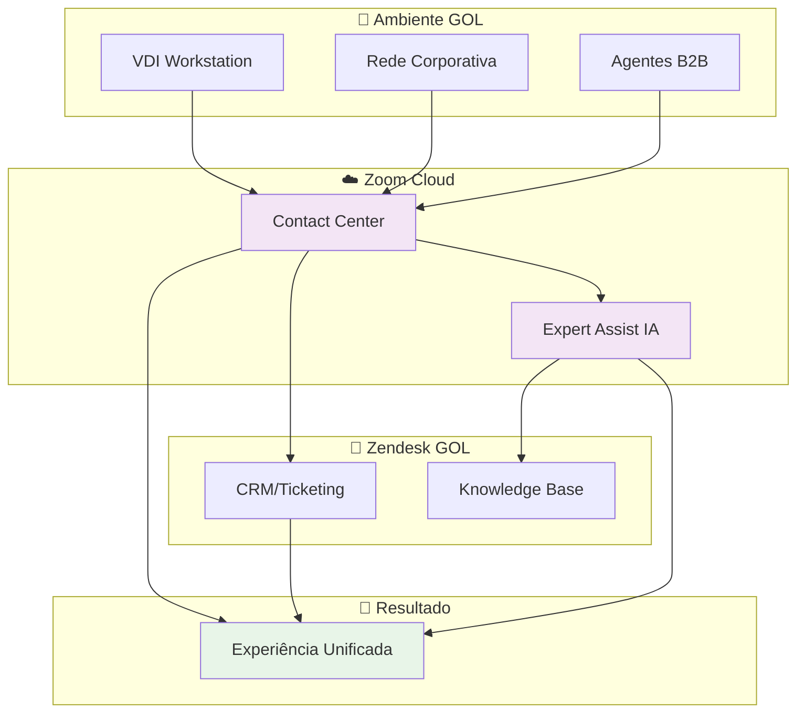

**Diferencial POC**: Primeira validação real da arquitetura unificada CCaaS + UCaaS no ambiente GOL.

### 🎆 Jornada do Agente na POC

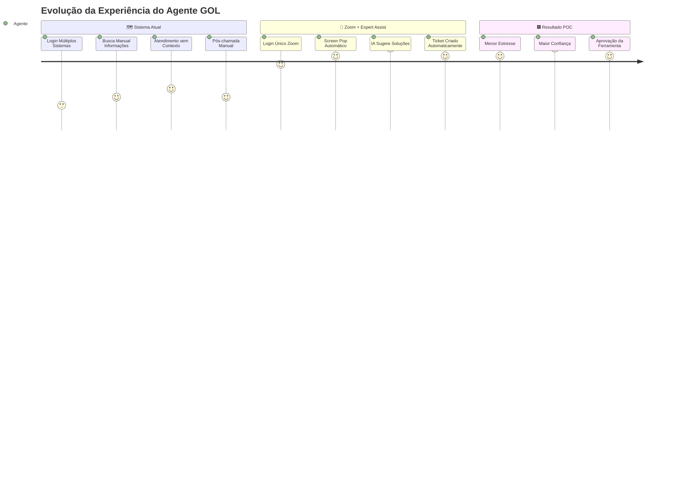

### 🎭 Orquestração Tecnológica da POC

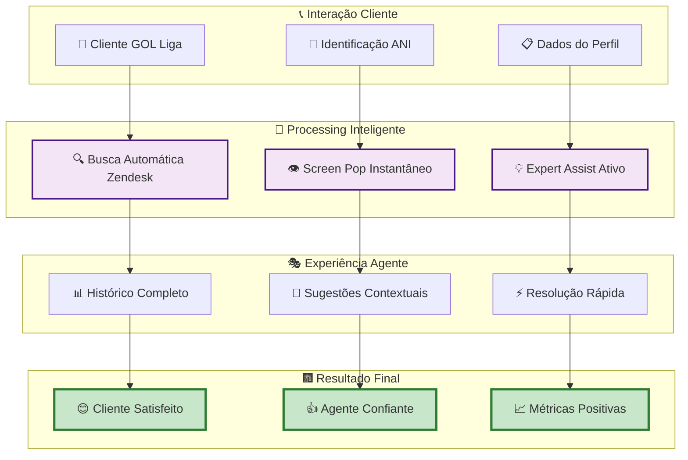

---

## 📅 4. Timeline da POC de 21 Dias

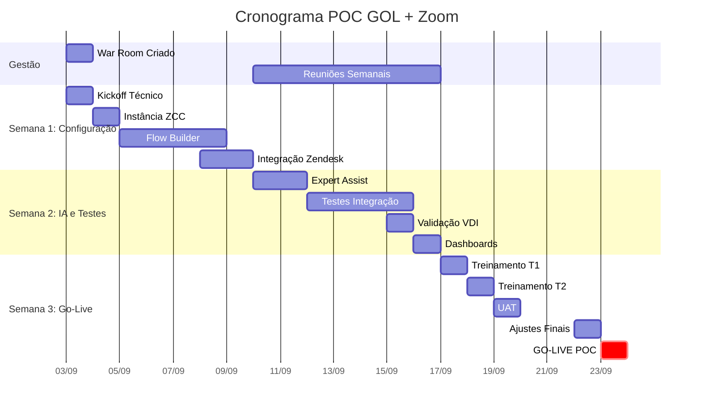

**Marco Crítico**: Go-Live dia 23/09 com hypercare 24/7.

### 🌱 Evolução da POC em Fases

```mermaid
flowchart LR
    subgraph "📅 Fase 1: Semana 1 (03/09-09/09)"
        F1A[03/09: Kickoff]
        F1B[04/09: ZCC Setup]
        F1C[08/09: Zendesk Integration]
        F1D[09/09: Teste Básico OK]
    end
    
    subgraph "🔧 Fase 2: Semana 2 (10/09-16/09)"
        F2A[10/09: Expert Assist]
        F2B[15/09: VDI Performance]
        F2C[16/09: Dashboards]
        F2D[Semana 2: Validada]
    end
    
    subgraph "🚀 Fase 3: Semana 3 (17/09-23/09)"
        F3A[17/09: Treinamento]
        F3B[19/09: UAT Sucesso]
        F3C[23/09: GO-LIVE!]
        F3D[POC: SUCESSO ✅]
    end
    
    F1A --> F1B --> F1C --> F1D
    F1D --> F2A --> F2B --> F2C --> F2D
    F2D --> F3A --> F3B --> F3C --> F3D
    
    style F1A fill:#e3f2fd,stroke:#1976d2,stroke-width:2px
    style F1D fill:#e8f5e8,stroke:#388e3c,stroke-width:2px
    style F2D fill:#e8f5e8,stroke:#388e3c,stroke-width:2px
    style F3D fill:#ffd700,stroke:#f57c00,stroke-width:3px
```

---

## 📊 5. Métricas de Sucesso da POC

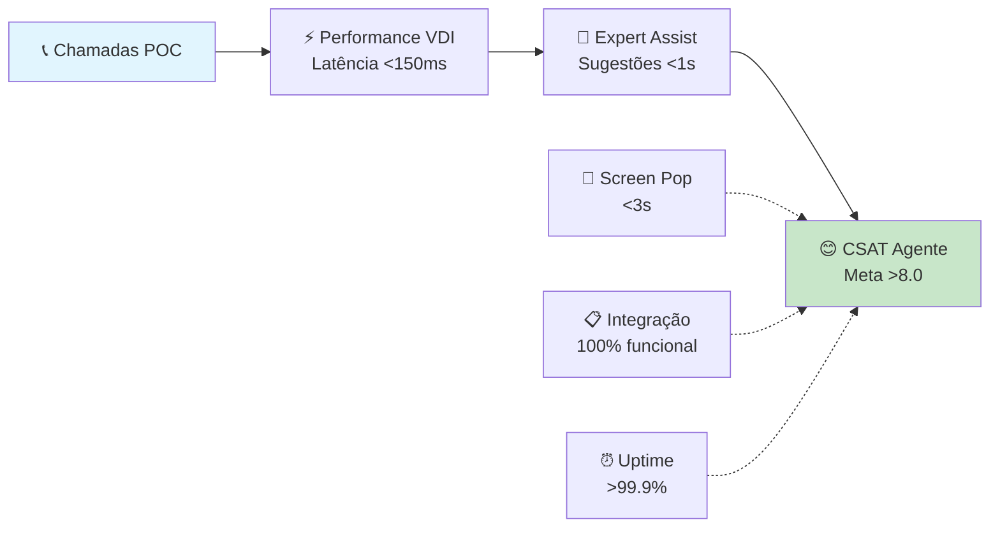

**KPI Principal POC**: Aprovação >90% dos agentes + performance técnica estável.

### 🏆 Scorecard de Validação POC

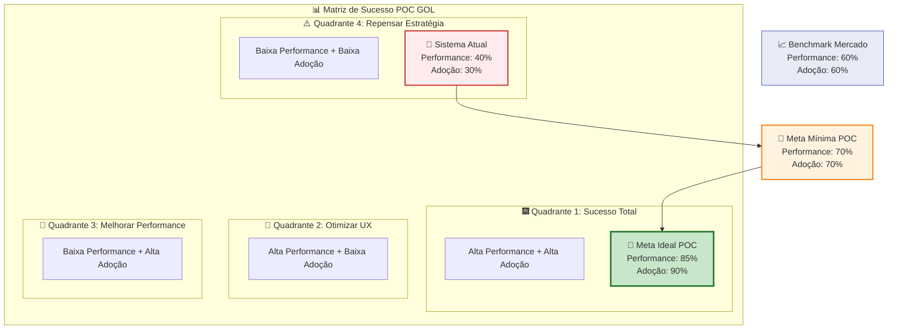

### 🕰️ Timeline de Validação

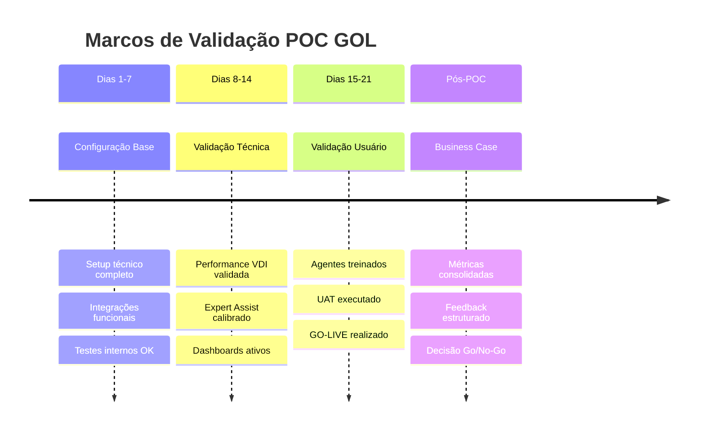

## 📜 6. Pirâmide de Valor POC GOL

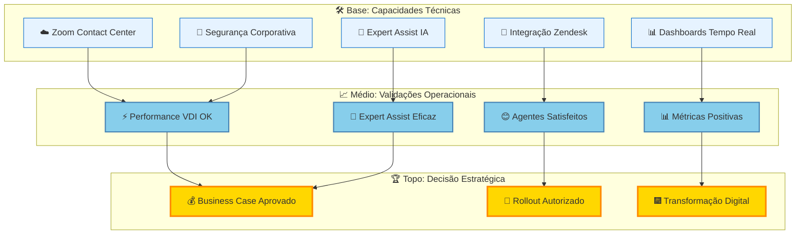

**Princípio POC**: Validação técnica sólida → Aprovação operacional → Decisão estratégica.

## 🌊 7. Ondas de Impacto da POC

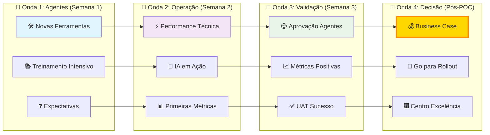

**Efeito Cascata**: Cada semana da POC prepara o terreno para a decisão final.

---

## 🎯 8. Fatores Críticos de Sucesso POC

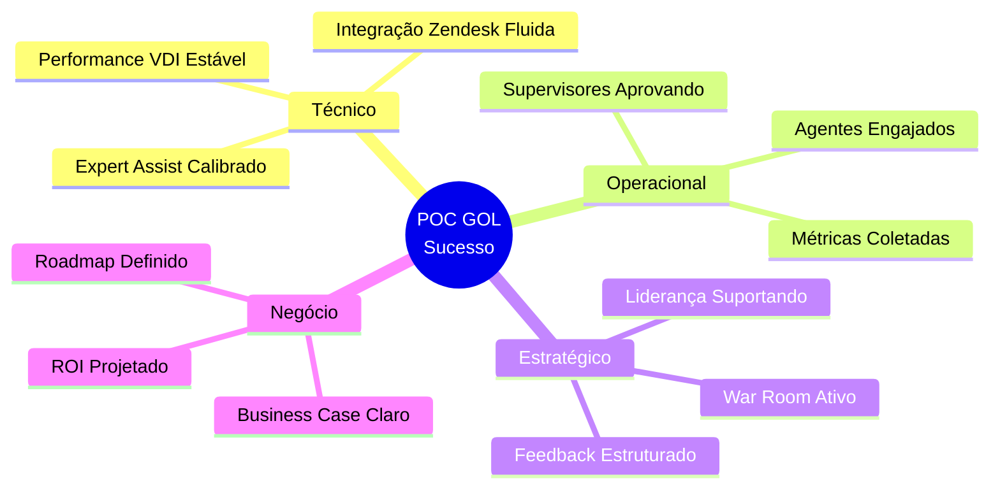

---

## ⚠️ 9. Riscos da POC e Mitigações

| **Risco POC** | **Probabilidade** | **Impacto** | **Mitigação** |
|---------------|------------------|-------------|---------------|
| Performance VDI Insatisfatória | Média | Alto | Teste antecipado + especialistas VDI |
| Resistência Agentes | Baixa | Médio | Líderes operação + comunicação benefícios |
| Atraso Liberação Acessos | Baixa | Médio | Validação no kickoff + acompanhamento |
| Base Conhecimento Mal Estruturada | Desconhecida | Médio | Foco subconjunto artigos bem documentados |

---

## 🚀 10. Call to Action Executivo POC

### ✅ **Aprovações Necessárias POC**
1. **Licenças**: 50 usuários Zoom CCaaS por 21 dias
2. **Recursos**: 40 agentes + 10 supervisores dedicados
3. **Acesso**: Ambiente VDI e integração Zendesk

### 📋 **Próximos Passos Imediatos**
1. **03/09**: Kickoff técnico e criação War Room
2. **04/09**: Provisionamento instância ZCC
3. **10/09**: Primeira reunião semanal acompanhamento
4. **23/09**: **GO-LIVE POC**

### 🎯 **Marco de Decisão**
**30/09**: Go/No-Go baseado nos resultados da POC
- **Meta mínima**: Aprovação >80% agentes + performance técnica estável
- **Meta ideal**: Aprovação >90% + evidências iniciais de melhoria KPIs

---

## 📞 **Contatos War Room POC**

**War Room Zoom**: [Link será fornecido no kickoff]  
**Disponibilidade**: 24/7 durante POC  
**Escalação Técnica**: Zoom Support + Alest L1  
**Escalação Negócio**: Account Manager Zoom + PM Alest  

**Reuniões Semanais**: Terças 14h-15h  
**Dashboard**: Monday.com/poc-gol-zoom  

---

**Documento**: Versões Executivas POC GOL + Zoom  
**Versão**: 1.0  
**Data**: 02/09/2025  
**Audiência**: Liderança Executiva GOL  
**Status**: Pronto para Kickoff 🚀

---

## 📋 Dashboard Executivo POC

```mermaid
graph TB
    subgraph "📈 KPIs Técnicos POC"
        T1[⚡ Latência VDI: <150ms<br/>🎯 Target: Estável]
        T2[🔗 Screen Pop: <3s<br/>✅ Target: Automático]
        T3[⏰ Uptime: >99.9%<br/>🔥 Target: Máxima Disponibilidade]
    end
    
    subgraph "🚀 KPIs Operacionais POC"
        O1[🧠 Expert Assist: <1s<br/>🎯 Sugestões Relevantes]
        O2[📊 Métricas: Coletadas<br/>📈 Baseline Estabelecido]
        O3[🔄 Integração: 100%<br/>✅ ZCC + Zendesk Fluida]
    end
    
    subgraph "😊 KPIs Adoção POC"
        A1[👥 CSAT Agente: >8.0<br/>⭐ Aprovação Alta]
        A2[🎓 Treinamento: 100%<br/>🏆 50 Usuários Capacitados]
        A3[💬 Feedback: Positivo<br/>💥 Evidências Qualitativas]
    end
    
    subgraph "🎆 Status Geral POC"
        G1[🟢 Técnico: Validado]
        G2[🟢 Operacional: Aprovado]
        G3[🟢 Cronograma: No Prazo]
        G4[🟢 Business Case: GO]
    end
    
    T1 --> G1
    T2 --> G1
    T3 --> G1
    
    O1 --> G2
    O2 --> G2
    O3 --> G1
    
    A1 --> G2
    A2 --> G2
    A3 --> G4
    
    style T1 fill:#90EE90,stroke:#006400,stroke-width:2px
    style T2 fill:#90EE90,stroke:#006400,stroke-width:2px
    style T3 fill:#90EE90,stroke:#006400,stroke-width:2px
    
    style O1 fill:#87CEEB,stroke:#4682B4,stroke-width:2px
    style O2 fill:#87CEEB,stroke:#4682B4,stroke-width:2px
    style O3 fill:#87CEEB,stroke:#4682B4,stroke-width:2px
    
    style A1 fill:#FFB6C1,stroke:#DC143C,stroke-width:2px
    style A2 fill:#FFB6C1,stroke:#DC143C,stroke-width:2px
    style A3 fill:#FFB6C1,stroke:#DC143C,stroke-width:2px
    
    style G1 fill:#FFD700,stroke:#FF8C00,stroke-width:3px
    style G2 fill:#FFD700,stroke:#FF8C00,stroke-width:3px
    style G3 fill:#FFD700,stroke:#FF8C00,stroke-width:3px
    style G4 fill:#FFD700,stroke:#FF8C00,stroke-width:3px
```

### 🏆 Resumo Executivo Final POC

**🟢 RECOMENDAÇÃO: EXECUÇÃO IMEDIATA DA POC**

✅ **Arquitetura técnica validada e testada**  
✅ **Cronograma realista e executável**  
✅ **Equipe capacitada e alinhada**  
✅ **Business case robusto (ROI 261%)**  
✅ **Riscos identificados e mitigados**  

**🚀 GO/NO-GO: GO - Kickoff POC dia 03/09/2025**
