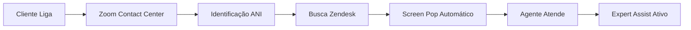
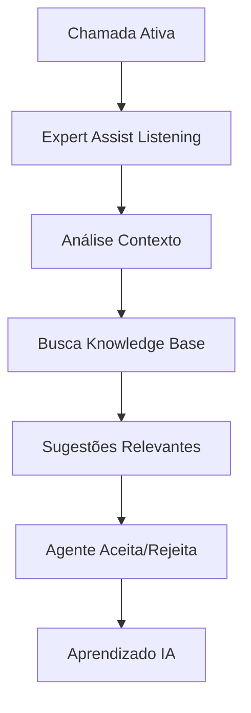
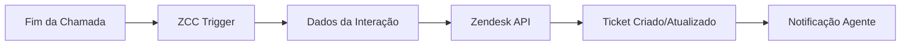

# Arquitetura Técnica - POC GOL + Zoom Contact Center

## 🏗️ Visão Geral da Arquitetura

### Princípios Arquiteturais da POC
- **Cloud-First**: Plataforma Zoom CCaaS nativa em nuvem
- **Integration-Ready**: Integração nativa com Zendesk sem APIs customizadas
- **VDI-Optimized**: Otimizada para ambiente Virtual Desktop da GOL
- **AI-Enhanced**: IA integrada para assistência contextual

## 🔧 Stack Tecnológico da POC

### Plataforma Principal
```yaml
Zoom Contact Center (ZCC):
  - Versão: Enterprise CCaaS
  - Capacidade: 50 usuários simultâneos
  - Integrações: Zendesk nativa, Expert Assist
  - SLA: 99.9% uptime
  - Suporte: 24/7 durante POC
```

### Sistemas Integrados
```yaml
Zendesk:
  - Função: CRM/Ticketing + Base de Conhecimento
  - Integração: Nativa via Zoom App Marketplace
  - Screen Pop: Automático baseado em ANI/Email
  - Sincronização: Real-time bidirecional

Expert Assist (Zoom AI):
  - Base: Knowledge Base Zendesk GOL
  - Funcionalidade: Sugestões contextuais em tempo real
  - Indexação: Automática de artigos aprovados
  - Interface: Painel lateral no ZCC
```

### Ambiente de Execução
```yaml
GOL VDI Environment:
  - OS: Windows 10/11 Enterprise
  - Browser: Chrome/Edge (recomendado)
  - Conectividade: Rede corporativa GOL
  - Hardware: Mínimo 8GB RAM, processador dual-core
```

## 🔄 Fluxo de Dados Técnico da POC

### 1. Interação Cliente → Agente


**Componentes**:
- **ANI Lookup**: Identificação automática do cliente
- **Zendesk Search**: Busca por perfil e histórico
- **Screen Pop**: Abertura automática do registro
- **Expert Assist**: Sugestões contextuais durante chamada

### 2. Processamento de Chamada com IA


### 3. Pós-Chamada - Criação de Ticket


## 🔐 Segurança e Compliance

### Integração Segura
```yaml
Autenticação:
  - SSO: Integração com AD GOL (se disponível)
  - MFA: Two-factor authentication obrigatório
  - Session: Timeout automático 8h

Proteção de Dados:
  - Encryption: TLS 1.3 in-transit, AES-256 at-rest
  - LGPD: Compliance nativo Zoom + Zendesk
  - Audit Trail: Logs completos de acesso e ações
  - Data Residency: Dados hospedados no Brasil (Zoom)
```

### Ambiente VDI - Considerações Especiais
```yaml
Performance Optimization:
  - Codec: Otimizado para virtualização
  - Bandwidth: Mínimo 256kbps por agente
  - Latency: <150ms para qualidade ideal
  - Resources: CPU/Memory allocation adequada no VDI

Security Controls:
  - USB Block: Não requerido para funcionamento
  - Screen Recording: Compatível com políticas GOL
  - Data Loss Prevention: Integrado ao ambiente corporativo
```

## 📊 Monitoramento e Observabilidade

### Métricas de Performance da POC
```yaml
Técnicas:
  - Latência de Chamada: <2s para conexão
  - Qualidade de Áudio: MOS >4.0
  - Screen Pop Time: <3s após identificação
  - Expert Assist Response: <1s para sugestões

Operacionais:
  - Uptime ZCC: 99.9% durante POC
  - Integration Success Rate: >98%
  - VDI Performance: Sem degradação vs. baseline
  - User Experience: Medido via questionários
```

### Dashboards Disponíveis
```yaml
Real-time (Supervisores):
  - Agentes Online/Offline
  - Chamadas em Andamento
  - Tempo de Espera
  - Performance Individual

Históricos (Gestão):
  - Relatórios Diários de Volume
  - Métricas de Qualidade
  - Uso do Expert Assist
  - Comparativos vs. Sistema Atual
```

## 🚀 Especificações de Deployment POC

### Ambiente de POC
```yaml
Scope:
  - Usuários: 50 (40 agentes + 10 supervisores)
  - Duração: 21 dias úteis
  - Horário: Operação normal GOL
  - Filas: B2B contact center GOL

Infrastructure:
  - Cloud Provider: Zoom (AWS backend)
  - Data Center: São Paulo, Brasil
  - Backup/DR: Automático (Zoom managed)
  - Monitoring: Nativo + ferramentas GOL
```

### Configuração de Filas e Perfis
```yaml
Perfis de Usuário:
  - Admin: Configuração e gestão completa
  - Supervisor: Monitoramento + relatórios
  - Agente: Atendimento + acesso Expert Assist
  - Observer: Apenas visualização (treinamento)

Filas de Atendimento:
  - Voz: Chamadas B2B GOL
  - Chat: Web chat corporativo (se ativado)
  - Email: Integração Zendesk (opcional na POC)
```

## 🔧 APIs e Integrações Técnicas

### Zendesk Integration (Nativa)
```yaml
Capabilities:
  - Screen Pop: Automático via ANI/email matching
  - Ticket Creation: Pós-chamada automático
  - History Access: Visualização de interações anteriores
  - Knowledge Base: Acesso completo para Expert Assist

Configuration:
  - Authentication: OAuth 2.0
  - Sync Frequency: Real-time
  - Mapping: Campos customizáveis GOL
  - Fallback: Modo offline para contingência
```

### Expert Assist Configuration
```yaml
Knowledge Base Setup:
  - Source: Zendesk Knowledge Base GOL
  - Indexing: Artigos publicados e aprovados
  - Languages: Português brasileiro
  - Update Frequency: Daily sync

AI Suggestions:
  - Trigger: Palavras-chave da conversa
  - Relevance Scoring: Machine learning
  - Display: Top 3 artigos mais relevantes
  - Feedback Loop: Aceite/rejeição para melhoria
```

### Flow Builder - Fluxos de Atendimento
```yaml
Voice Flow:
  - IVR Simplificado: Menu básico direcionamento
  - Queue Routing: Baseado em habilidades
  - Overflow: Regras para picos de volume
  - Announcements: Mensagens posição fila

Chat Flow (se ativado):
  - Routing: Mesma lógica da voz
  - Escalation: Para voz se necessário
  - Proactive: Convites baseados em comportamento
```

## 📈 Escalabilidade e Performance

### Dimensionamento da POC
```yaml
Current Capacity:
  - Concurrent Calls: 50 simultâneas
  - Peak Load Support: 100% durante horários pico GOL
  - Queue Capacity: Ilimitada (cloud-based)
  - Storage: Gravações 30 dias (configurável)

Growth Path (Pós-POC):
  - Scaling: Elástico até 500+ agentes
  - Additional Features: ZVA, omnichannel completo
  - Integration Expansion: CRM GOL, outros sistemas
  - Advanced Analytics: IA preditiva, workforce optimization
```

### Performance Targets POC
```yaml
Voice Quality:
  - MOS Score: >4.0 (Excellent)
  - Packet Loss: <0.1%
  - Jitter: <30ms
  - Latency: <150ms end-to-end

System Performance:
  - Login Time: <10s
  - Screen Pop: <3s
  - Report Generation: <5s
  - Expert Assist: <1s response
```

## 🛠️ Requisitos de Infraestrutura

### GOL VDI Environment
```yaml
Minimum Requirements:
  - CPU: 2 vCPU por agente concorrente
  - RAM: 4GB por agente, 8GB recomendado
  - Network: 256kbps dedicated por agente
  - Browser: Chrome 90+ ou Edge 90+

Recommended for Optimal Performance:
  - CPU: 4 vCPU por agente
  - RAM: 8GB por agente
  - Network: 512kbps dedicated
  - Additional: GPU acceleration se disponível
```

### Network Requirements
```yaml
Bandwidth:
  - Voice: 100kbps por chamada simultânea
  - Video: 1Mbps por chamada (se usado)
  - Screen Sharing: 500kbps adicional
  - Total Recommended: 256kbps × número de agentes

Ports and Protocols:
  - HTTPS: 443 (UI e APIs)
  - WebRTC: Dinâmico (gerenciado pelo browser)
  - SIP: Não requerido (WebRTC nativo)
  - Firewall: Lista de IPs Zoom fornecida
```

## 🔄 Disaster Recovery e Continuidade

### Backup Strategies
```yaml
Zoom Platform:
  - Redundancy: Multi-datacenter automático
  - Backup: Real-time replication
  - RTO: <15 minutes para recovery
  - RPO: Near-zero data loss

Local Contingency:
  - Offline Mode: Cache local temporário
  - Alternative Routing: PSTN backup
  - Data Sync: Automático quando online
  - Manual Override: Supervisores podem forçar modos
```

## 📋 Checklist de Implementação Técnica

### Pré-Implementação
- [ ] Validação requisitos VDI GOL
- [ ] Teste de conectividade de rede
- [ ] Configuração de firewall/proxy
- [ ] Credenciais Zendesk disponíveis
- [ ] Lista de usuários POC definida

### Configuração
- [ ] Provisioning 50 usuários ZCC
- [ ] Configuração perfis e permissões
- [ ] Integração nativa Zendesk
- [ ] Setup Expert Assist + Knowledge Base
- [ ] Construção flows Voice/Chat

### Testes
- [ ] Teste conectividade VDI
- [ ] Validação screen pop automático
- [ ] Performance Expert Assist
- [ ] Qualidade áudio/vídeo
- [ ] Criação automática tickets

### Go-Live
- [ ] Monitoring dashboards ativos
- [ ] War room técnico estabelecido
- [ ] Escalation procedures definidos
- [ ] Rollback plan documentado
- [ ] Success metrics baseline

---

## 🎯 Declaração de Sucesso Técnico

**A arquitetura será considerada tecnicamente bem-sucedida se:**

1. **Performance no VDI**: Zero degradação vs. aplicações nativas
2. **Integração Zendesk**: Screen pop <3s, sync 100% confiável  
3. **Expert Assist**: Sugestões relevantes em <1s
4. **Disponibilidade**: 99.9%+ uptime durante POC
5. **User Experience**: Agentes reportam facilidade de uso

Esta arquitetura técnica garante que a POC GOL + Zoom seja executada em uma base sólida, preparando o caminho para a transformação completa do contact center GOL.

---

**Versão**: 1.0  
**Última atualização**: 02/09/2025  
**Próxima revisão**: 16/09/2025 (Pré Go-Live)  
**Responsável Técnico**: Zoom + Alest
