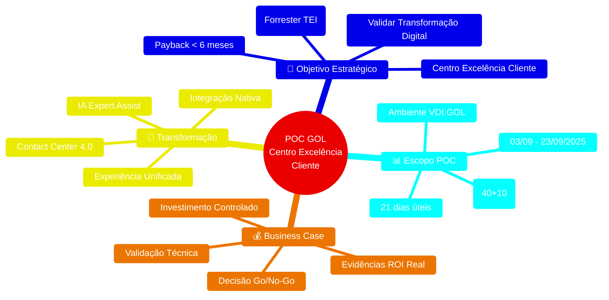
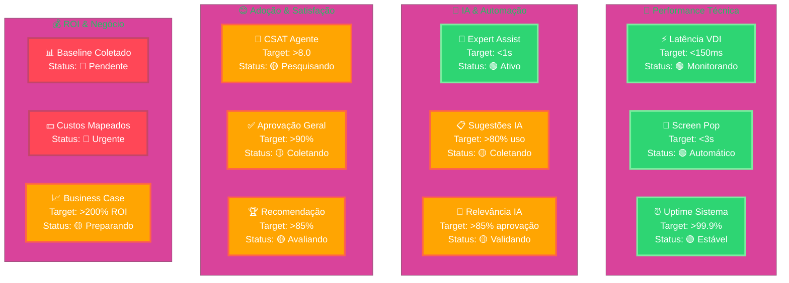

# Executive Dashboard - POC GOL + Zoom Contact Center
**Visão Executiva Consolidada para Tomada de Decisão Estratégica**

## 📊 Executive Summary Dashboard

### 🎯 **Visão Geral Estratégica**

---

## 🏆 **Scorecard Executivo POC**

### 📈 **KPIs Críticos de Sucesso**

**Legenda**: 🟢 No Target | 🟡 Em Progresso | 🔴 Ação Necessária

**Documento**: Executive Dashboard POC GOL + Zoom  
**Versão**: 1.0  
**Data**: 09/09/2025  
**Status**: Ativo - Monitoramento Executivo 🚀