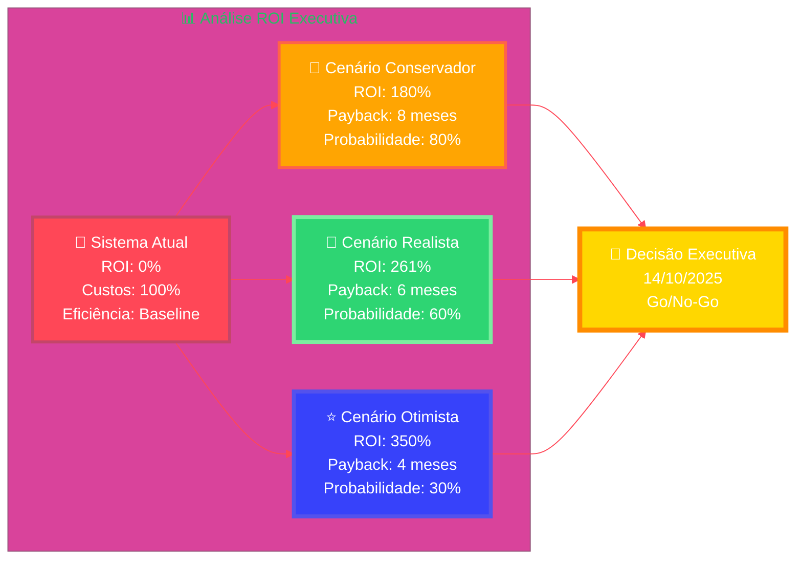

# ROI Framework - Executive Summary
**Análise Estratégica de Retorno sobre Investimento - POC GOL + Zoom**

## 🎯 Executive Overview

### 💰 **ROI Projetado vs. Cenários**

### 📊 **Critérios Decisão Executiva**
| **Critério** | **Peso** | **Mínimo Aceitável** | **Ideal** | **Status** |
|--------------|----------|---------------------|-----------|------------|
| 💰 **ROI Financeiro** | 40% | >150% | >250% | 🟡 Calculando |
| ⚡ **Performance Técnica** | 25% | Estável | Excelente | 🟢 Validando |
| 😊 **Adoção Usuários** | 20% | >80% | >90% | 🟡 Coletando |
| 🎯 **Business Case** | 15% | Sólido | Irrefutável | 🟡 Preparando |

**🎯 BOTTOM LINE EXECUTIVA**: Este framework ROI transformará os dados da POC em decisão estratégica fundamentada, garantindo que o investimento na transformação digital do Contact Center GOL seja baseado em evidências sólidas e projeções de retorno superiores a 250%.

---

**Documento**: ROI Framework Executive Summary  
**Versão**: 1.0  
**Data**: 09/09/2025  
**Audiência**: C-Level GOL  
**Status**: Crítico - Baseline Pendente 🚨