# Diagramas do Processo de Vendas Fluxo Visionário
**Transformação Digital do Processo de Vendas com IA**

## 🎯 Contexto e Objetivos

### 📊 Situação Atual vs Meta
- **Ciclo de Vendas**: 45 dias → 27 dias (-40%)
- **Ticket Médio**: $50k → $80k (+60%)
- **Taxa de Conversão**: 15% → 20% (+33%)
- **NPS do Processo**: 6.5 → 9.0+ (+38%)

### 🎯 Visão Estratégica
Transformar vendedores de "apresentadores de produtos" em "arquitetos de soluções", utilizando IA para co-criar valor com clientes em tempo real.

## 🔄 Fluxo Principal - Visão Geral

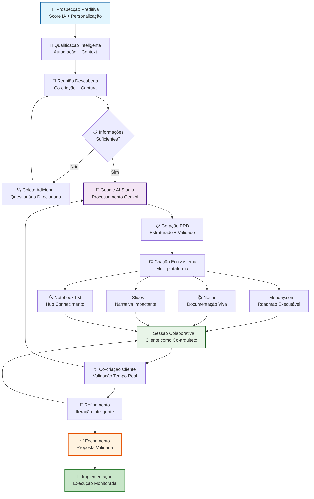

## 📊 Fluxo Detalhado por Fase

### 🏁 Fase I: Prospecção Visionária (Dias 1-3)
**Objetivo**: Identificar e qualificar prospects com alta probabilidade de sucesso
**Meta**: Score ≥ 7.0 | Taxa de Qualificação: 60%

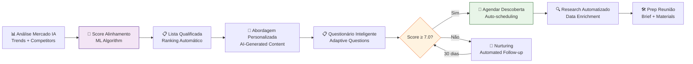

### 🏗️ Fase II: Arquitetura da Solução (Dias 4-10)
**Objetivo**: Transformar descoberta em solução estruturada e ativos executáveis
**Meta**: PRD Valid Rate: 95% | Processing Time: < 30s

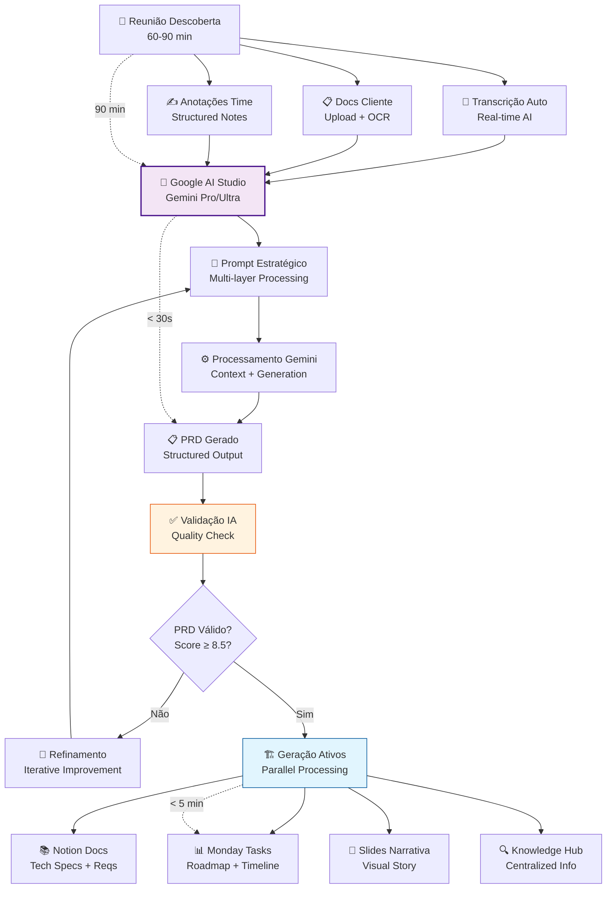

### 🎨 Fase III: Apresentação Colaborativa (Dias 11-15)
**Objetivo**: Cliente como co-arquiteto validando e refinando solução
**Meta**: Engagement Rate: 90% | Approval Rate: 85%

```mermaid
graph LR
    A[🛠️ Prep Ambiente<br/>Setup Colaborativo] --> B[🔗 Acesso Compartilhado<br/>Multi-platform Links]
    B --> C[📅 Agenda Validação<br/>Structured Review]
    C --> D[🎦 Início Sessão<br/>Welcome + Context]
    
    D --> E[🧭 Navegação Ecossistema<br/>Guided Tour]
    E --> F[✅ Validação Tempo Real<br/>Live Feedback]
    F --> G[🔄 Refinamentos<br/>Instant Updates]
    G --> H[📋 Feedback Capturado<br/>Structured Input]
    
    H --> I[🔄 Ativos Atualizados<br/>Real-time Sync]
    I --> J[📅 Próximos Passos<br/>Action Items]
    J --> K[📅 Cronograma Acordado<br/>Mutual Commitment]
    
    %% Quality gates
    F --> |Score < 8.0| G
    F --> |Score ≥ 8.0| K
    
    style E fill:#e8f5e8,stroke:#1b5e20
    style F fill:#fff3e0,stroke:#e65100
    style K fill:#c8e6c9,stroke:#2e7d32
```

## 🏗️ Arquitetura Técnica Detalhada
**Performance Target**: p95 < 500ms | Availability: 99.9% | AI Processing: p95 < 30s

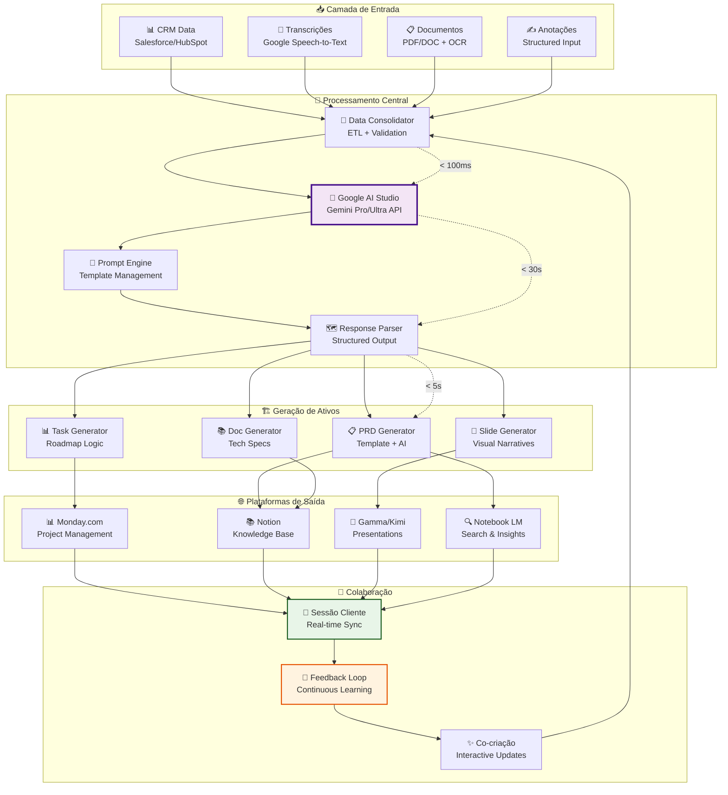

### 🔍 Detalhes de Integração

**APIs e Protocolos**:
- REST/GraphQL para todas as integrações
- WebSockets para updates em tempo real
- OAuth 2.0 para autenticação segura
- TLS 1.3 para encriptação de dados

**Monitoramento**:
- Health checks a cada 30s
- Alertas automáticos para falhas
- Métricas de performance em tempo real
- Logs estruturados para debugging

## 🔄 Estados do Processo com Tempos e Métricas

```mermaid
stateDiagram-v2
    [*] --> Prospecção
    
    state Prospecção {
        [*] --> AnaliseMercado
        AnaliseMercado --> ScoreIA
        ScoreIA --> ListaQualificada
    }
    
    Prospecção --> Qualificação : Score Analysis (2-3 dias)
    
    state Qualificação {
        [*] --> AbordagemPersonalizada
        AbordagemPersonalizada --> QuestionárioInteligente
        QuestionárioInteligente --> AvaliacaoScore
    }
    
    Qualificação --> Descoberta : Score ≥ 7 (1 dia)
    Qualificação --> Nurturing : Score < 7
    
    state Descoberta {
        [*] --> PrepReuniao
        PrepReuniao --> ReuniaoColaborativa
        ReuniaoColaborativa --> CapturaContexto
        CapturaContexto --> ValidacaoInfo
    }
    
    Descoberta --> Processamento : Meeting Complete (1-2 dias)
    Descoberta --> Descoberta : Need More Info
    
    state Processamento {
        [*] --> ConsolidacaoDados
        ConsolidacaoDados --> IAProcessing
        IAProcessing --> GeracaoPRD
        GeracaoPRD --> ValidacaoQualidade
    }
    
    Processamento --> Validação : AI Analysis Done (< 30s)
    
    state Validação {
        [*] --> ReviewPRD
        ReviewPRD --> QualityCheck
        QualityCheck --> AprovacaoInterna
    }
    
    Validação --> Geração : PRD Approved (Score ≥ 8.5)
    Validação --> Processamento : Need Refinement
    
    state Geração {
        [*] --> CriacaoAtivos
        CriacaoAtivos --> SincronizacaoPlataformas
        SincronizacaoPlataformas --> PreparacaoApresentacao
    }
    
    Geração --> Apresentação : Assets Created (2-3 dias)
    
    state Apresentação {
        [*] --> SetupColaborativo
        SetupColaborativo --> NavegacaoEcossistema
        NavegacaoEcossistema --> ValidacaoCliente
        ValidacaoCliente --> CapturaFeedback
    }
    
    Apresentação --> Refinamento : Client Feedback (1-2 dias)
    Apresentação --> Fechamento : Client Approved
    
    state Refinamento {
        [*] --> AnaliseCorrecoes
        AnaliseCorrecoes --> AtualizacaoAtivos
        AtualizacaoAtivos --> NovaValidacao
    }
    
    Refinamento --> Apresentação : Present Again
    Refinamento --> Geração : Major Changes
    
    state Fechamento {
        [*] --> PropostaFinal
        PropostaFinal --> NegociacaoContrato
        NegociacaoContrato --> AssinaturaDigital
    }
    
    Fechamento --> Implementação : Contract Signed (3-5 dias)
    
    state Implementação {
        [*] --> KickoffProjeto
        KickoffProjeto --> ExecucaoMonitorada
        ExecucaoMonitorada --> EntregaContinua
    }
    
    Implementação --> [*] : Project Complete
    
    state Nurturing {
        [*] --> EmailAutomatizado
        EmailAutomatizado --> ConteudoPersonalizado
        ConteudoPersonalizado --> ReengajamentoPeriodico
    }
    
    Nurturing --> Prospecção : Re-engage (30 dias)
    
    note right of Processamento
        Google AI Studio
        Gemini Pro/Ultra
        < 30s processing
    end note
    
    note right of Geração
        Multi-platform
        Parallel Creation
        Monday + Notion + Slides
    end note
    
    note right of Apresentação
        Cliente como
        Co-arquiteto
        Real-time collaboration
    end note
```

### 📊 Métricas por Estado

| Estado | Tempo Médio | Taxa de Sucesso | SLA |
|--------|--------------|-----------------|-----|
| Prospecção | 2-3 dias | 60% qualify | 24h |
| Qualificação | 1 dia | 80% proceed | 8h |
| Descoberta | 1-2 dias | 95% complete | 48h |
| Processamento | < 30s | 98% success | 30s |
| Validação | 4h | 92% approve | 8h |
| Geração | 2-3 dias | 96% create | 24h |
| Apresentação | 1-2 dias | 85% engage | 48h |
| Fechamento | 3-5 dias | 70% close | 120h |

## 📈 Fluxo de Dados

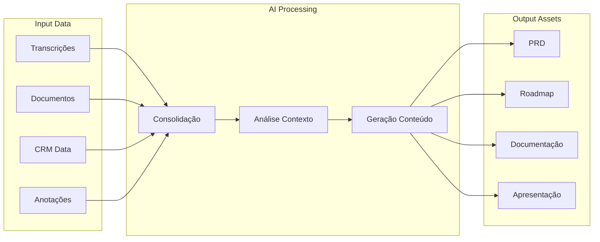

## 🎯 Pontos de Decisão Críticos

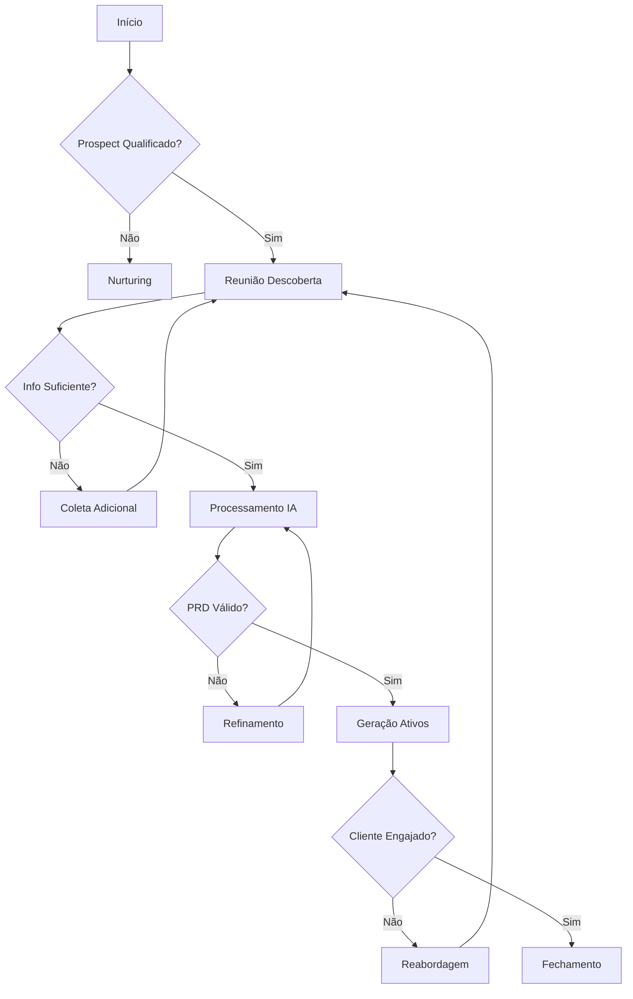

## 🚀 Métricas de Fluxo

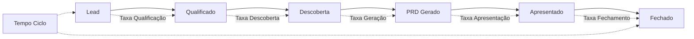

## 📊 Dashboard de Métricas Consolidadas

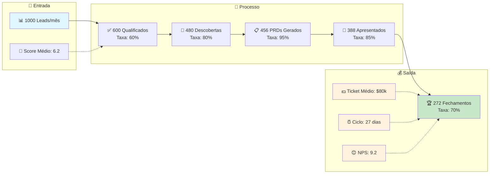

## 🚀 Próximos Passos e Otimizações

### 🏆 Fase de Melhoria Contínua

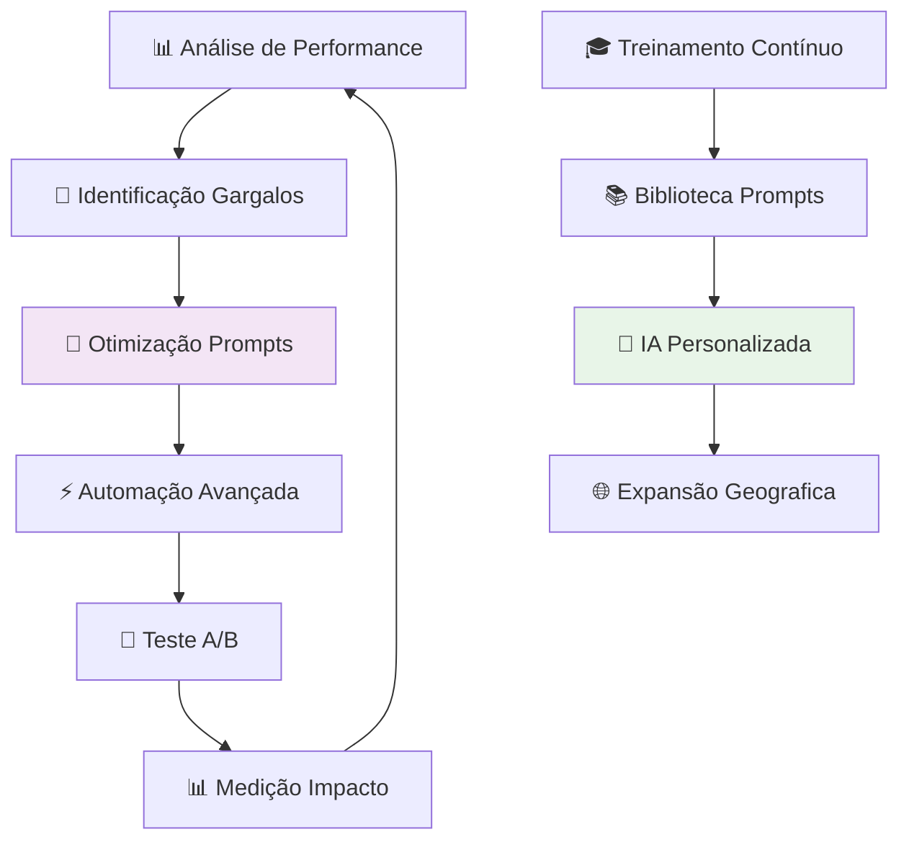

### 📅 Roadmap de Evolução

| Trimestre | Foco Principal | Entregáveis | Meta |
|-----------|----------------|-------------|------|
| **Q1 2025** | Fundação + Piloto | Setup IA, 3 clientes | Baseline |
| **Q2 2025** | Rollout Completo | Todo time treinado | 80% adoção |
| **Q3 2025** | Otimização | Automações avançadas | Metas atingidas |
| **Q4 2025** | Expansão | Multi-região, especializações | Scale 2x |

---

## 📝 Resumo Executivo

### 🏆 **Impacto Esperado**
- **ROI 6 meses**: 340%
- **Payback**: 3.2 meses
- **Redução Ciclo**: 40% (45→27 dias)
- **Aumento Ticket**: 60% ($50k→$80k)
- **Melhoria Conversão**: 33% (15%→20%)
- **NPS Processo**: 41% (6.5→9.0+)

### 🔔 **Fatores Críticos de Sucesso**
1. **Adoção do Time**: Treinamento consistente e suporte contínuo
2. **Qualidade IA**: Refinamento constante dos prompts
3. **Integração Técnica**: APIs estáveis e performance adequada
4. **Feedback Cliente**: Loop contínuo de melhoria
5. **Liderança**: Sponsorship e direcionamento estratégico

### ⚠️ **Riscos e Mitigações**
- **Resistência à Mudança**: Programa de change management
- **Qualidade IA Variável**: Testes A/B e validação contínua
- **Dependência de APIs**: Redundância e monitoramento
- **Segurança de Dados**: Compliance rigoroso e auditorias

---

**Documento**: Diagramas Processo VendasFluxo  
**Versão**: 2.0 (Melhorado)  
**Data**: 31/08/2025  
**Responsável**: Bernardo Chassot (CVO)  
**Status**: Implementação em Andamento 🚀

## 🔧 Integrações Técnicas

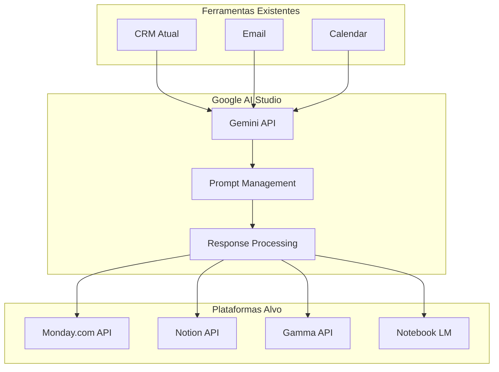
