# Diagramas Mermaid - Sistema VendasFluxo
**Visualização Completa dos Fluxos do Sistema**

## 🔄 1. Fluxo Principal do Processo de Vendas

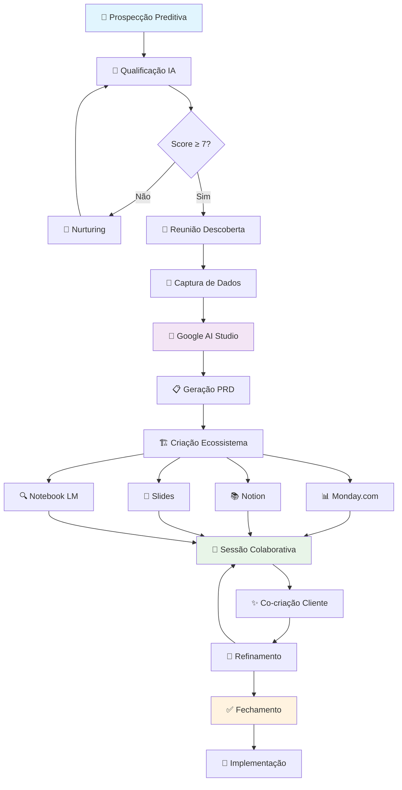

## 🏗️ 2. Arquitetura Técnica do Sistema

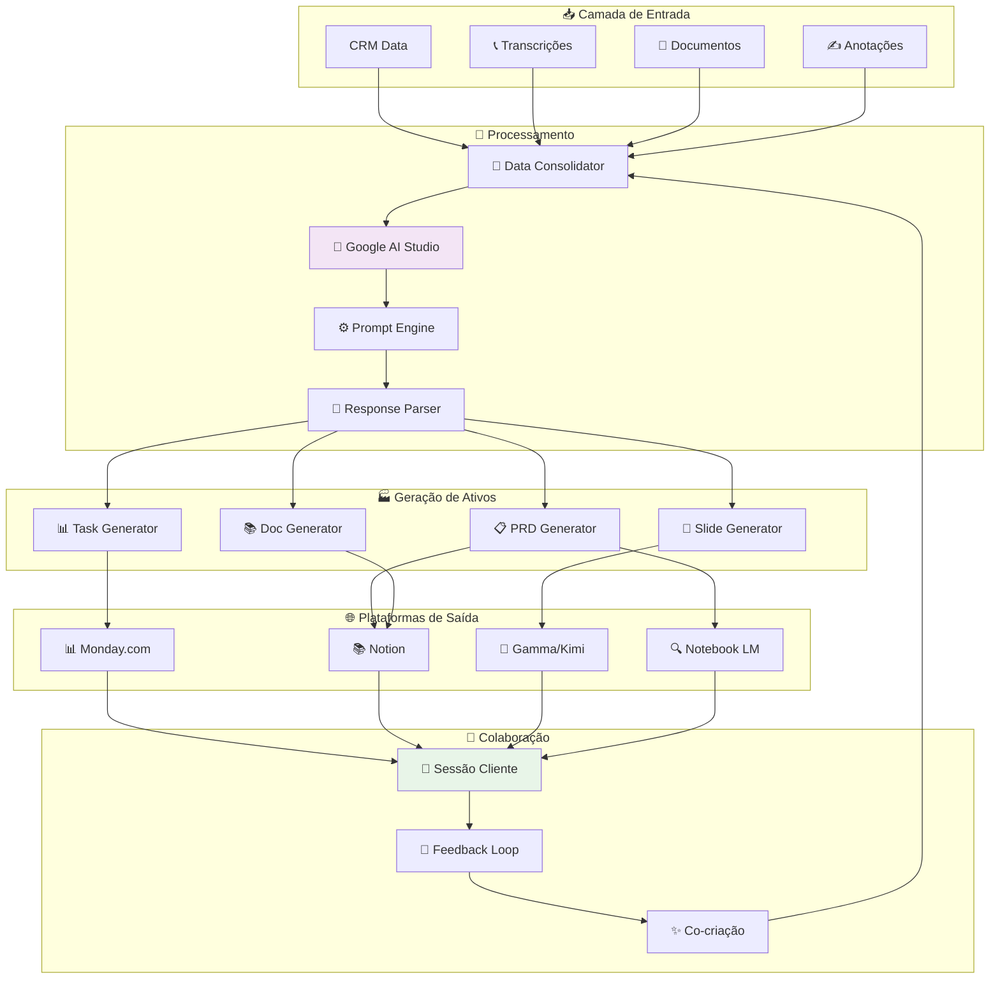

## 📊 3. Fluxo de Dados Detalhado

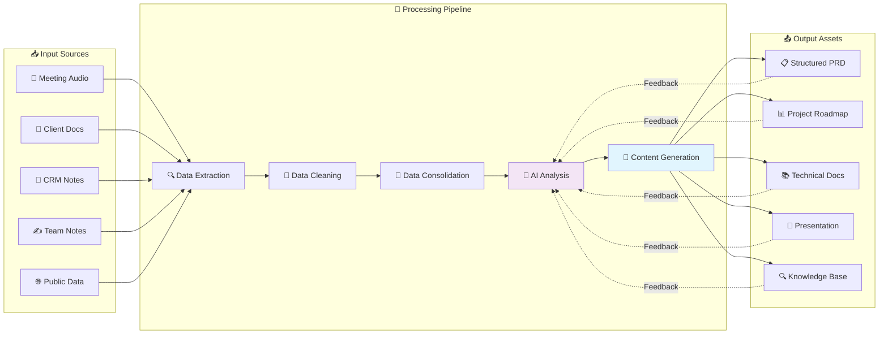

## 🔄 4. Estados do Processo de Vendas

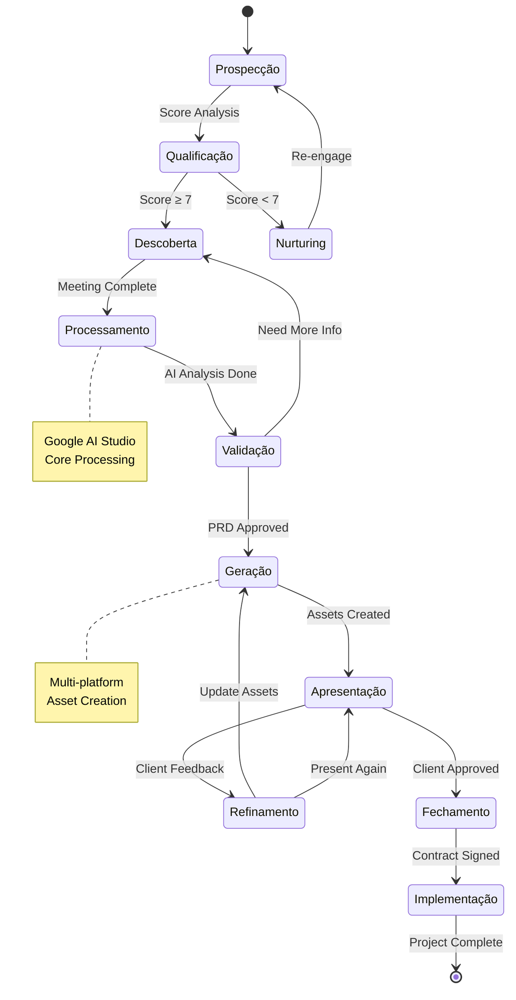

## 🤝 5. Fluxo de Colaboração Cliente

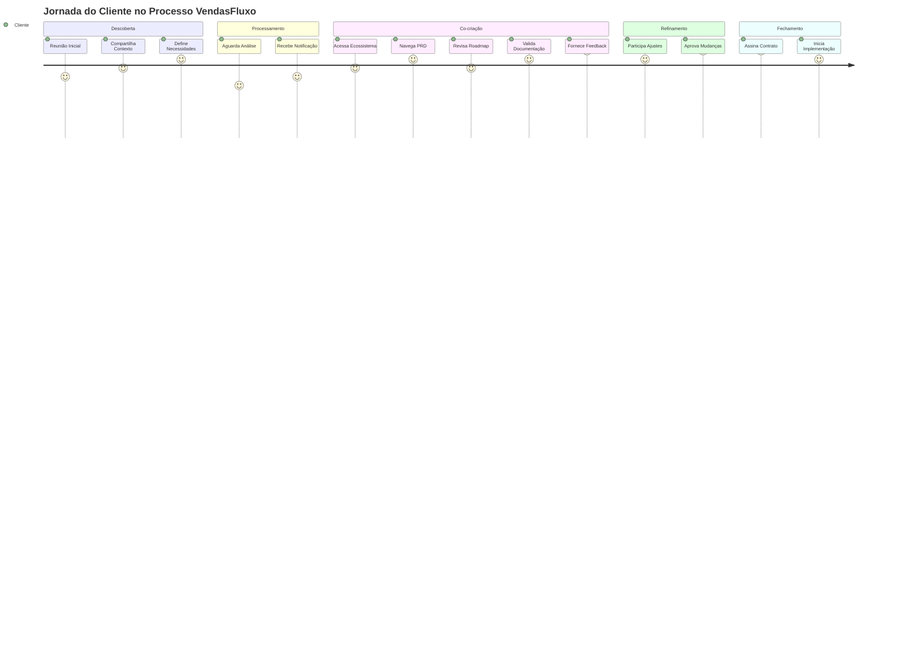

## ⚡ 6. Integração entre Plataformas

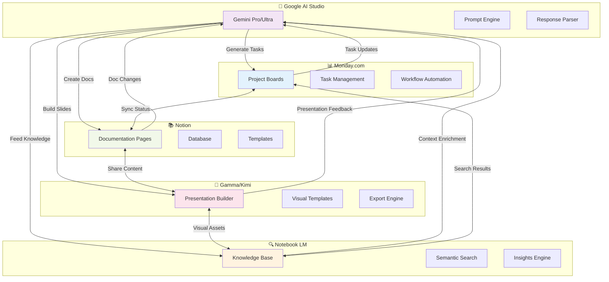

## 🎯 7. Pontos de Decisão Críticos

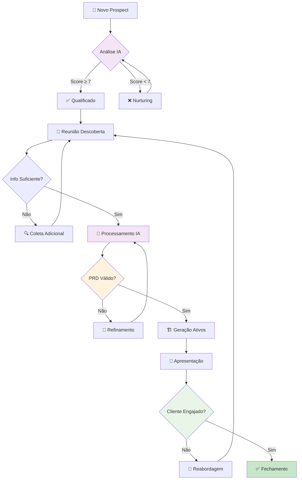

## 📈 8. Métricas e KPIs Flow

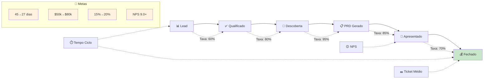

## 🔧 9. Troubleshooting Flow

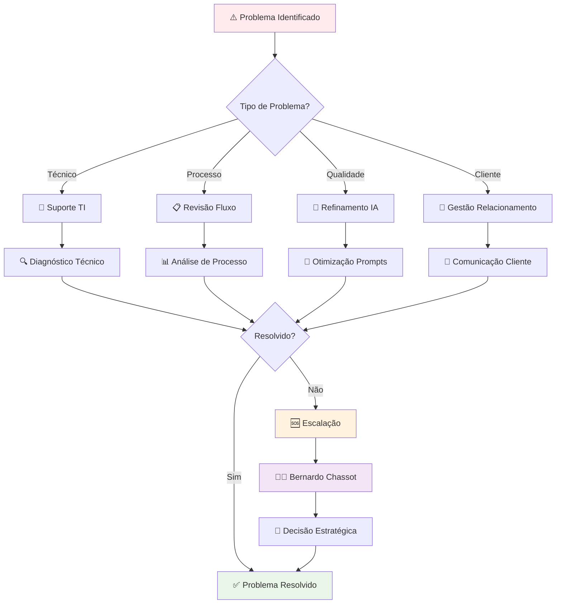

## 🎓 10. Fluxo de Onboarding da Equipe de Vendas

```mermaid
journey
    title Jornada de Onboarding - Time de Vendas VendasFluxo
    
    section Semana 1: Fundação
      Setup Google AI Studio: 7: Vendedor
      Treinamento Conceitos IA: 8: Vendedor
      Primeiros Prompts: 6: Vendedor
      Simulação Básica: 7: Vendedor
      
    section Semana 2: Prática
      Reunião Real Supervisionada: 8: Vendedor
      Uso das Integrações: 9: Vendedor
      Geração PRD Assistida: 8: Vendedor
      Feedback e Ajustes: 9: Vendedor
      
    section Semana 3: Autonomia
      Processo Completo Solo: 9: Vendedor
      Apresentação Cliente: 10: Vendedor
      Refinamento Autônomo: 8: Vendedor
      
    section Semana 4: Otimização
      Análise de Métricas: 9: Vendedor
      Personalização Prompts: 10: Vendedor
      Mentoria Colegas: 8: Vendedor
      Certificação Final: 10: Vendedor
```

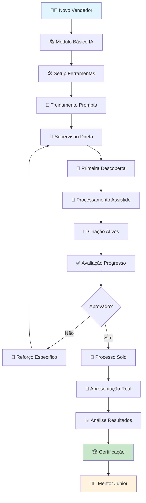

## ⚡ 11. Fluxo de Automação e Processos Inteligentes

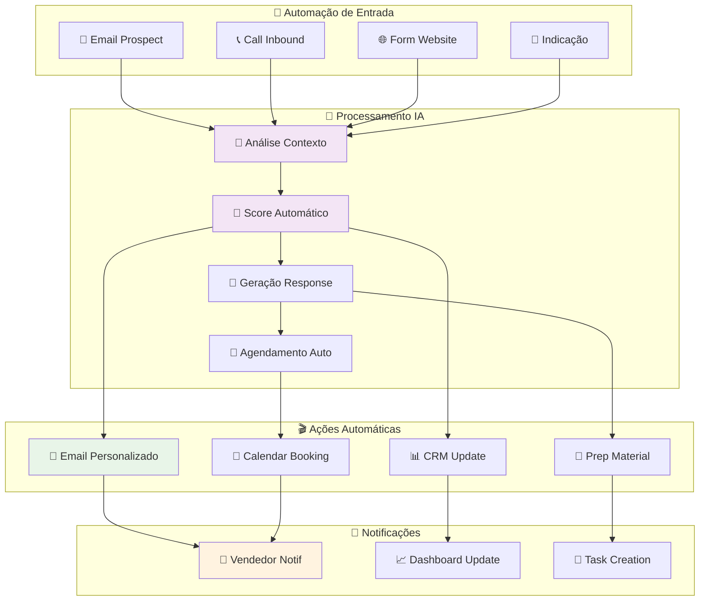

## 💰 12. Fluxo de ROI e Métricas Financeiras

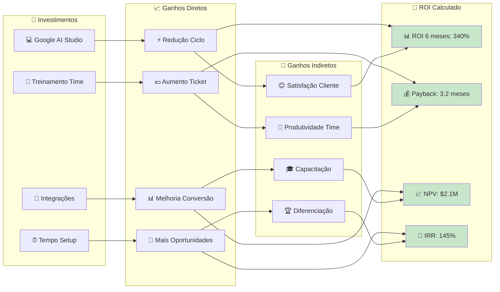

## 🔐 13. Fluxo de Segurança e Governança de Dados

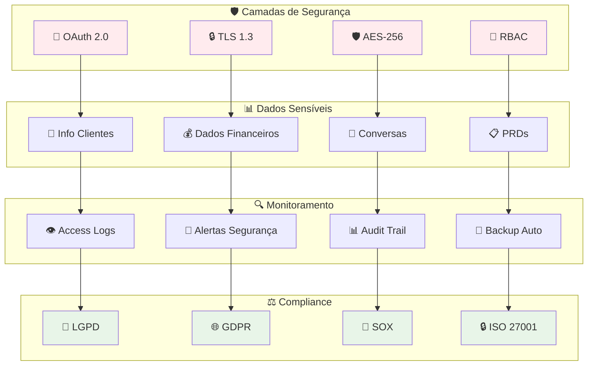

## 📋 14. Versão Executiva - Fluxo Simplificado

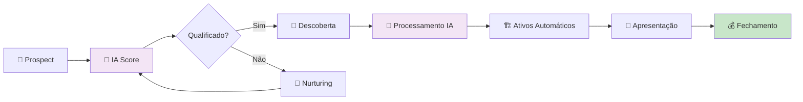

## 🎪 15. Fluxo de Escalabilidade e Crescimento

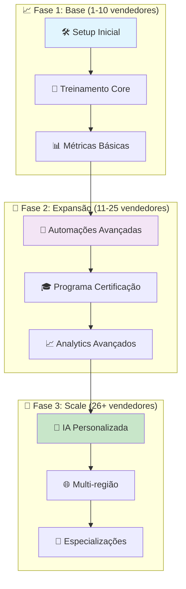

---

**Legenda de Ícones:**
- 🎯 Prospecção/Objetivos
- 🤖 Automação/IA
- 🤝 Interação Humana
- 📊 Dados/Analytics
- 📚 Documentação
- 🎨 Criação/Design
- 🔍 Pesquisa/Análise
- ✅ Sucesso/Aprovação
- ⚠️ Atenção/Problema
- 🔄 Processo/Loop
- 🎓 Treinamento/Capacitação
- 💰 Financeiro/ROI
- 🔐 Segurança/Compliance
- 📋 Gestão/Governança
