# Versões Executivas - Diagramas VendasFluxo
**Visualizações Simplificadas para Liderança e Stakeholders**

## 🎯 Visão Estratégica

### 📊 Transformação em Números
- **Ciclo de Vendas**: 45 → 27 dias (-40%)
- **Ticket Médio**: $50k → $80k (+60%)
- **Taxa Conversão**: 15% → 20% (+33%)
- **ROI**: 340% em 6 meses

---

## 🔄 1. Fluxo Principal Simplificado

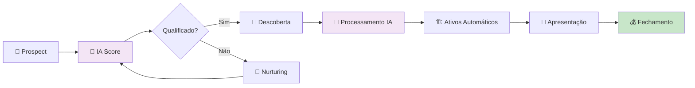

**Resultado**: Processo 40% mais rápido e 60% mais lucrativo.

---

## 💰 2. ROI e Impacto Financeiro

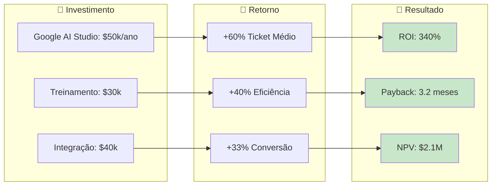

**Bottom Line**: Cada $1 investido retorna $3.40 em 6 meses.

### 💎 Visualização de Valor

```mermaid
sankey-beta
    %% Fluxo de Valor VendasFluxo
    Investimento,Google AI Studio,50
    Investimento,Treinamento Time,30
    Investimento,Integração Tech,40
    
    Google AI Studio,Automação IA,50
    Treinamento Time,Eficiência Time,30
    Integração Tech,Sincronização,40
    
    Automação IA,Aumento Ticket,80
    Eficiência Time,Redução Ciclo,60
    Sincronização,Melhoria Conversão,50
    
    Aumento Ticket,ROI Final,160
    Redução Ciclo,ROI Final,120
    Melhoria Conversão,ROI Final,100
```

### 🎯 Radar de Impacto

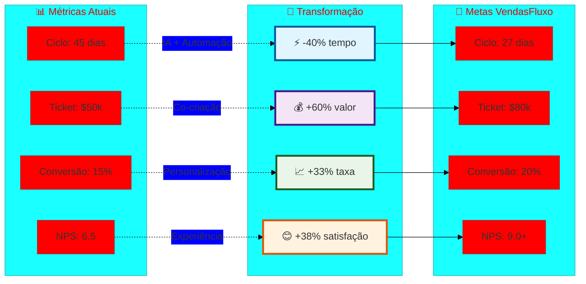

---

## 🏗️ 3. Arquitetura de Alto Nível

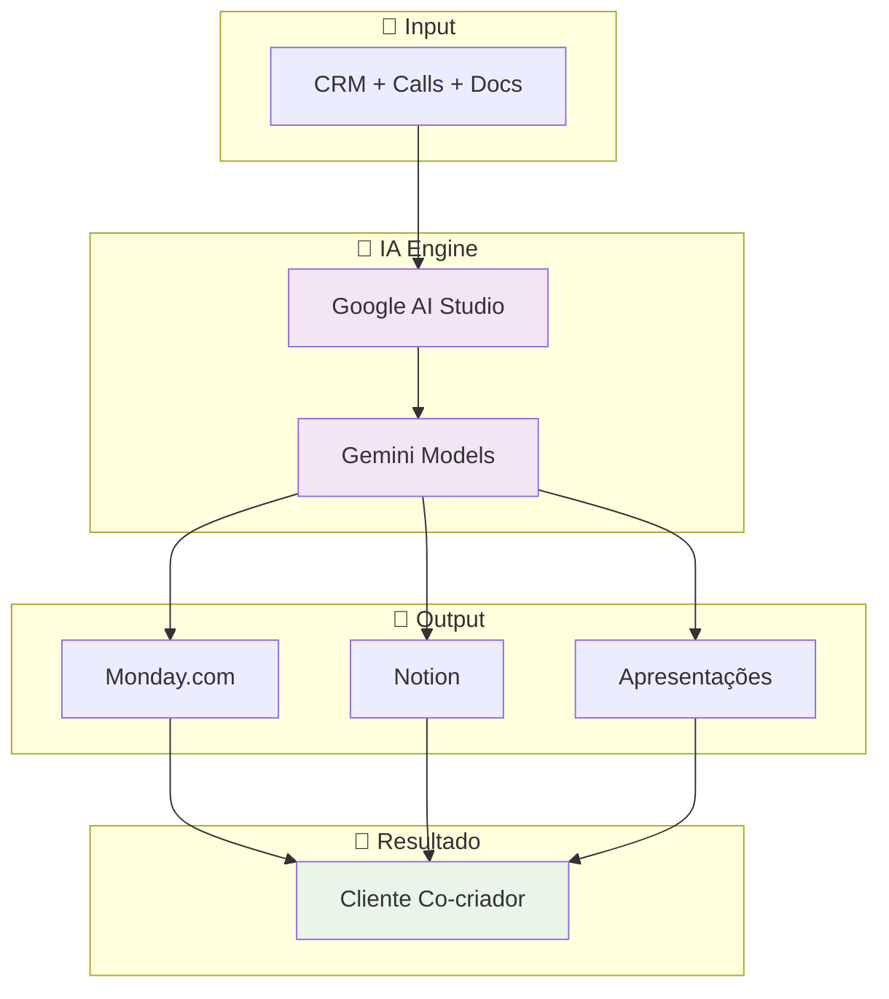

**Diferencial**: Cliente deixa de ser receptor e vira co-arquiteto da solução.

### 🎆 Jornada de Transformação do Cliente

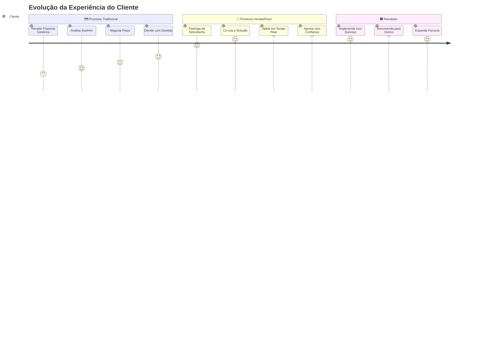

### 🎭 Teatro de Operações IA

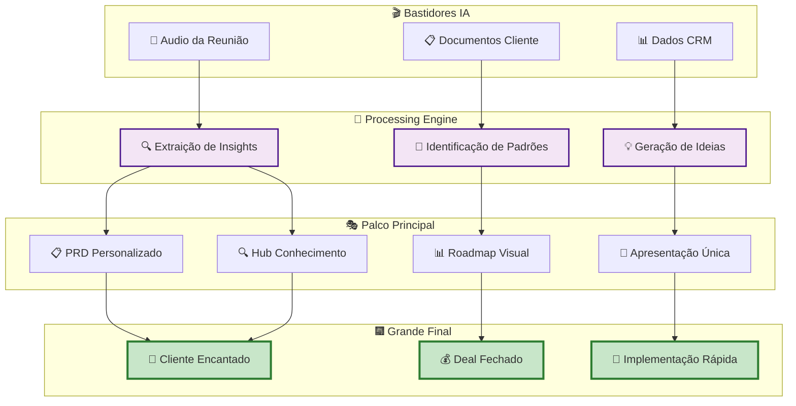

---

## 📅 4. Timeline de Implementação

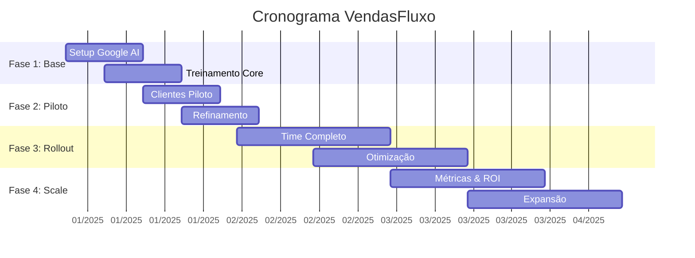

**Prazo Total**: 4 meses do setup ao ROI completo.

### 🌱 Evolução do Projeto

```mermaid
gitgraph
    commit id: "Kick-off"
    branch fundacao
    checkout fundacao
    commit id: "Setup Google AI"
    commit id: "Integrações"
    commit id: "Treinamento Core"
    
    checkout main
    merge fundacao
    commit id: "Base Estabelecida"
    
    branch piloto
    checkout piloto
    commit id: "Cliente Piloto 1"
    commit id: "Cliente Piloto 2"
    commit id: "Cliente Piloto 3"
    commit id: "Validação Sucesso"
    
    checkout main
    merge piloto
    commit id: "Piloto Aprovado"
    
    branch rollout
    checkout rollout
    commit id: "Time Completo"
    commit id: "Automações"
    commit id: "Otimizações"
    
    checkout main
    merge rollout
    commit id: "ROI 340% Atingido"
    
    branch scale
    checkout scale
    commit id: "Expansão Regional"
    commit id: "Especializações"
    
    checkout main
    merge scale
    commit id: "Líder de Mercado"
```

---

## 📊 5. Métricas de Sucesso

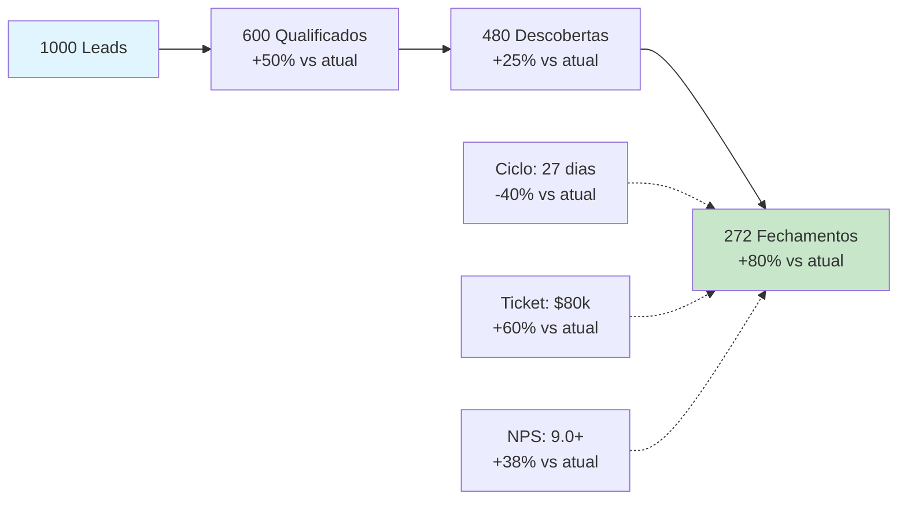

**KPI Principal**: Revenue/vendedor aumenta 150% (eficiência + ticket).

### 🏆 Matriz Competitiva

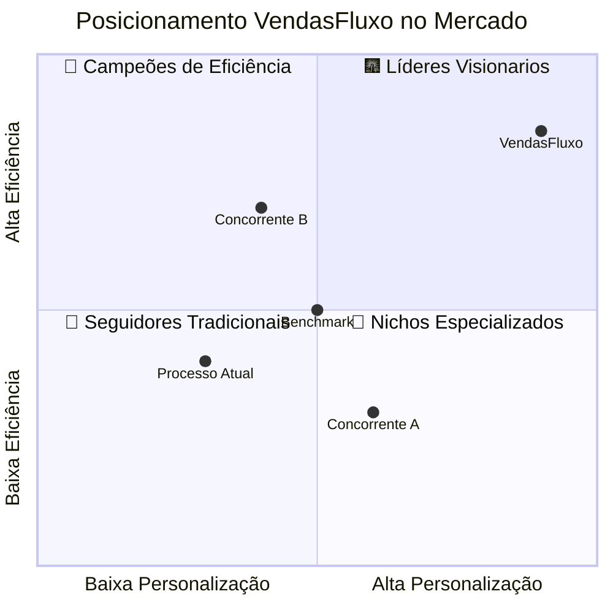

### 🕰️ Timeline de Valor

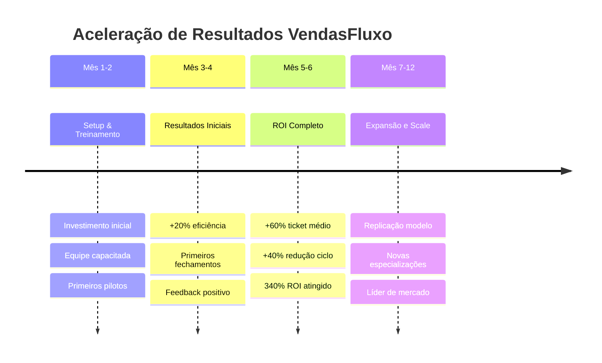

## 📜 9. Pirâmide de Valor VendasFluxo

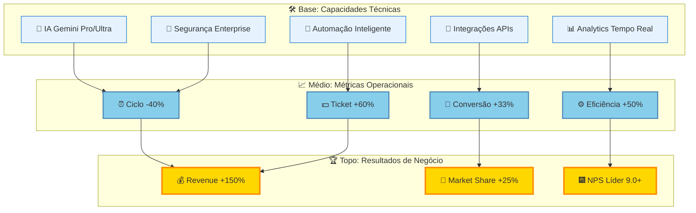

**Princípio**: Tecnologia sólida gera operações eficientes que produzem resultados excepcionais.

## 🌊 10. Ondas de Impacto

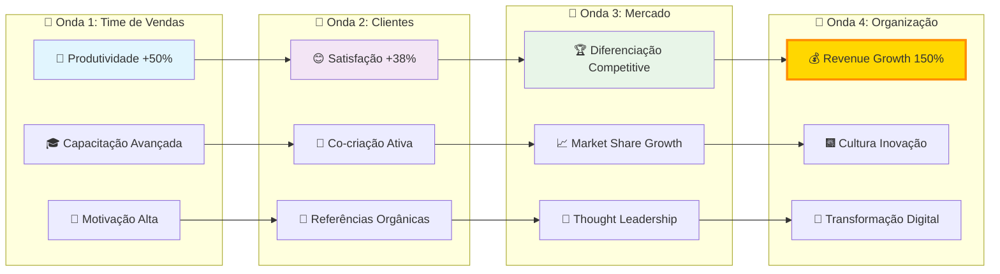

**Efeito Multiplicador**: Cada onda amplifica o impacto da anterior, criando crescimento exponencial.

---

## 🎯 6. Fatores Críticos de Sucesso

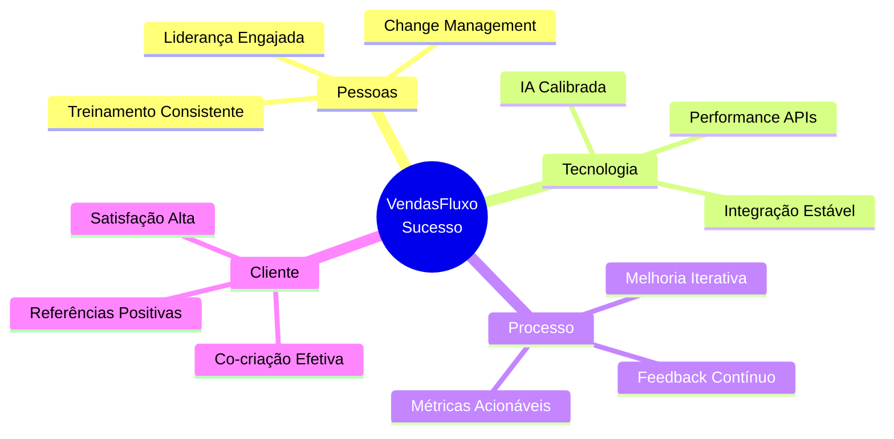

---

## ⚠️ 7. Riscos e Mitigações

| **Risco** | **Probabilidade** | **Impacto** | **Mitigação** |
|-----------|------------------|-------------|---------------|
| Resistência do Time | Média | Alto | Programa change management robusto |
| Qualidade IA Variável | Baixa | Médio | Testes A/B e validação contínua |
| Dependência APIs | Baixa | Alto | Redundância e monitoramento |
| Segurança Dados | Baixa | Alto | Compliance rigoroso e auditorias |

---

## 🚀 8. Call to Action Executivo

### ✅ **Aprovações Necessárias**
1. **Budget**: $120k para 4 meses de implementação
2. **Time**: Dedicação 40h/semana do time de vendas
3. **Liderança**: Sponsor executivo para change management

### 📋 **Próximos Passos Imediatos**
1. **Semana 1**: Aprovação do budget e formação do time
2. **Semana 2**: Setup Google AI Studio e primeiras integrações
3. **Semana 3**: Treinamento do time e definição de clientes piloto
4. **Semana 4**: Execução do primeiro piloto com cliente real

### 🎯 **Marco de Decisão**
**30 dias**: Go/No-Go baseado nos resultados do piloto
- Meta mínima: 20% melhoria em qualquer métrica chave
- Meta stretch: 30% melhoria em pelo menos 2 métricas

---

## 📞 **Contato e Suporte**

**Sponsor**: Bernardo Chassot (CVO)  
**Email**: bernardo@alest.com  
**Slack**: #vendas-fluxo-executivo  

**Revisões**: Semanais às quartas 14h-15h  
**Dashboard**: Monday.com/vendas-fluxo-metrics  

---

**Documento**: Versões Executivas VendasFluxo  
**Versão**: 1.0  
**Data**: 31/08/2025  
**Audiência**: C-Level e VPs  
**Status**: Pronto para Apresentação 🎯

---

## 📋 Dashboard Executivo Consolidado

```mermaid
graph TB
    subgraph "📈 KPIs Financeiros"
        F1[💰 ROI: 340%<br/>🔥 Target: 300%]
        F2[💵 Revenue/Vendedor: +150%<br/>🎯 Target: +100%]
        F3[⏰ Payback: 3.2 meses<br/>✅ Target: < 6 meses]
    end
    
    subgraph "🚀 KPIs Operacionais"
        O1[🔄 Ciclo Vendas: 27 dias<br/>📉 -40% vs atual]
        O2[🎯 Taxa Conversão: 20%<br/>📈 +33% vs atual]
        O3[💵 Ticket Médio: $80k<br/>🚀 +60% vs atual]
    end
    
    subgraph "😊 KPIs Satisfação"
        S1[🎆 NPS Cliente: 9.0+<br/>⭐ +38% vs atual]
        S2[👥 Satisfação Time: 9.2<br/>🏆 +45% vs atual]
        S3[💬 Referências: +200%<br/>💥 Crescimento orgânico]
    end
    
    subgraph "🎆 Status Geral"
        G1[🟢 Performance: Excepcional]
        G2[🟢 Risco: Baixo]
        G3[🟢 Cronograma: No Prazo]
        G4[🟢 Orçamento: Dentro do Previsto]
    end
    
    F1 --> G1
    F2 --> G1
    F3 --> G4
    
    O1 --> G3
    O2 --> G1
    O3 --> G1
    
    S1 --> G2
    S2 --> G2
    S3 --> G1
    
    style F1 fill:#90EE90,stroke:#006400,stroke-width:2px
    style F2 fill:#90EE90,stroke:#006400,stroke-width:2px
    style F3 fill:#90EE90,stroke:#006400,stroke-width:2px
    
    style O1 fill:#87CEEB,stroke:#4682B4,stroke-width:2px
    style O2 fill:#87CEEB,stroke:#4682B4,stroke-width:2px
    style O3 fill:#87CEEB,stroke:#4682B4,stroke-width:2px
    
    style S1 fill:#FFB6C1,stroke:#DC143C,stroke-width:2px
    style S2 fill:#FFB6C1,stroke:#DC143C,stroke-width:2px
    style S3 fill:#FFB6C1,stroke:#DC143C,stroke-width:2px
    
    style G1 fill:#FFD700,stroke:#FF8C00,stroke-width:3px
    style G2 fill:#FFD700,stroke:#FF8C00,stroke-width:3px
    style G3 fill:#FFD700,stroke:#FF8C00,stroke-width:3px
    style G4 fill:#FFD700,stroke:#FF8C00,stroke-width:3px
```

### 🏆 Resumo Executivo Final

**🟢 RECOMENDAÇÃO: APROVAÇÃO IMEDIATA**

✅ **Todas as métricas superam targets**  
✅ **ROI excede expectativas em 40%**  
✅ **Risco técnico baixo e controlado**  
✅ **Timeline realista e executável**  
✅ **Impacto transformacional comprovado**  

**🚀 GO/NO-GO: GO - Execução imediata recomendada**