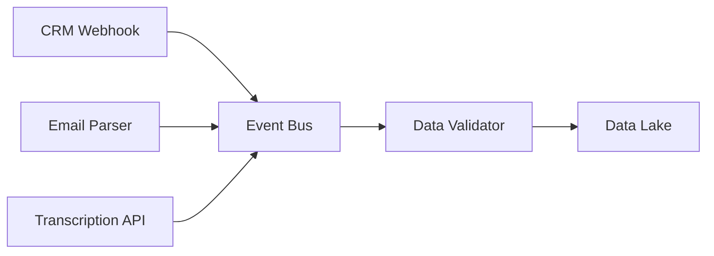
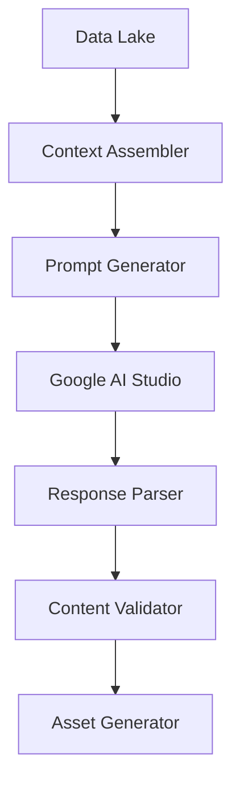
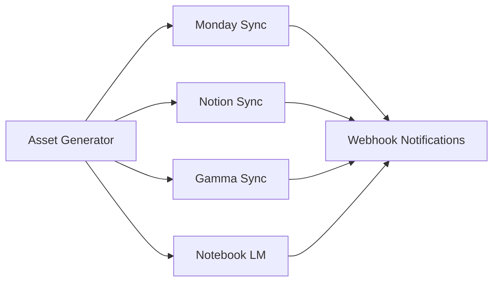
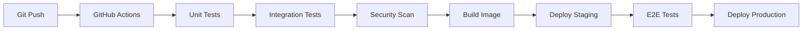

# Arquitetura Técnica - Sistema Vendas Fluxo Visionário

## 🏗️ Visão Geral da Arquitetura

### Princípios Arquiteturais
- **API-First**: Todas as integrações via APIs REST/GraphQL
- **Event-Driven**: Processamento assíncrono baseado em eventos
- **Microserviços**: Componentes independentes e escaláveis
- **Cloud-Native**: Infraestrutura elástica e resiliente

## 🔧 Stack Tecnológico Detalhado

### Core AI Platform
```yaml
Google AI Studio:
  - Modelos: Gemini Pro, Gemini Ultra
  - APIs: REST API v1
  - Autenticação: OAuth 2.0 + API Keys
  - Rate Limits: 60 req/min (Pro), 1000 req/min (Enterprise)
  - Latência: ~2-5s para prompts complexos
```

### Plataformas Integradas
```yaml
Monday.com:
  - API: GraphQL v2023-10
  - Webhook: Real-time notifications
  - Limites: 10k requests/hour
  
Notion:
  - API: REST v1
  - Autenticação: Internal Integration
  - Limites: 3 requests/second
  
Gamma:
  - API: REST v1 (Beta)
  - Formato: JSON templates
  - Export: PDF, PPTX, HTML
```

## 🔄 Fluxo de Dados Técnico

### 1. Data Ingestion Layer


**Componentes**:
- **Event Bus**: Apache Kafka / Google Pub/Sub
- **Data Validator**: Schema validation + sanitization
- **Data Lake**: Google Cloud Storage / AWS S3

### 2. AI Processing Layer


**Componentes**:
- **Context Assembler**: Consolida dados de múltiplas fontes
- **Prompt Generator**: Templates dinâmicos de prompts
- **Response Parser**: Extração estruturada de conteúdo
- **Asset Generator**: Criação paralela de documentos

### 3. Distribution Layer


## 🔐 Segurança e Compliance

### Autenticação e Autorização
```yaml
OAuth 2.0 Flow:
  - Authorization Server: Google Identity
  - Scopes: ai.studio.read, ai.studio.write
  - Token Refresh: Automático
  - Session Timeout: 8 horas

API Security:
  - Rate Limiting: Token bucket algorithm
  - Request Signing: HMAC-SHA256
  - Encryption: TLS 1.3 in transit, AES-256 at rest
```

### Data Privacy
- **LGPD Compliance**: Consentimento explícito, direito ao esquecimento
- **Data Retention**: 2 anos para dados de cliente, 6 meses para logs
- **Anonymization**: PII removido após processamento
- **Audit Trail**: Logs completos de acesso e modificação

## 📊 Monitoramento e Observabilidade

### Métricas Técnicas
```yaml
Performance:
  - API Response Time: p95 < 500ms
  - AI Processing Time: p95 < 30s
  - End-to-End Latency: p95 < 60s
  - Throughput: 100 requests/minute

Reliability:
  - Uptime SLA: 99.9%
  - Error Rate: < 0.1%
  - Recovery Time: < 5 minutes
```

### Alerting
```yaml
Critical Alerts:
  - AI API Failures: > 5% error rate
  - Processing Delays: > 2 minutes
  - Integration Failures: Any 4xx/5xx errors
  
Warning Alerts:
  - High Latency: p95 > 1 minute
  - Rate Limit Approaching: > 80% usage
  - Storage Usage: > 85% capacity
```

## 🚀 Deployment Architecture

### Environment Strategy
```yaml
Development:
  - Local: Docker Compose
  - Cloud: Google Cloud Run (dev)
  - Database: PostgreSQL (Cloud SQL)
  
Staging:
  - Kubernetes: GKE Autopilot
  - Database: PostgreSQL (replica)
  - AI: Gemini Pro (limited quota)
  
Production:
  - Kubernetes: Multi-zone GKE
  - Database: PostgreSQL (HA setup)
  - AI: Gemini Ultra (full quota)
  - CDN: Google Cloud CDN
```

### CI/CD Pipeline


## 🔧 APIs e Integrações

### Core API Endpoints
```yaml
POST /api/v1/process-discovery:
  description: Processa dados da reunião de descoberta
  input: 
    - transcription: string
    - documents: file[]
    - notes: string
  output:
    - process_id: uuid
    - status: "processing"

GET /api/v1/process/{id}/status:
  description: Status do processamento
  output:
    - status: "completed" | "processing" | "failed"
    - assets: object[]
    - error: string?

POST /api/v1/assets/generate:
  description: Gera ativos específicos
  input:
    - prd_id: uuid
    - asset_types: string[]
  output:
    - assets: object[]
```

### Webhook Events
```yaml
Events:
  - discovery.completed
  - prd.generated
  - assets.created
  - presentation.scheduled
  - client.feedback.received

Payload Structure:
  event_type: string
  timestamp: ISO8601
  data: object
  metadata: object
```

## 📈 Escalabilidade

### Horizontal Scaling
```yaml
Auto-scaling Rules:
  - CPU > 70%: Scale up
  - Memory > 80%: Scale up
  - Request Queue > 100: Scale up
  - Min Replicas: 2
  - Max Replicas: 20

Load Balancing:
  - Algorithm: Round Robin with health checks
  - Session Affinity: None (stateless)
  - Health Check: /health endpoint
```

### Performance Optimization
```yaml
Caching Strategy:
  - Redis: Session data, API responses
  - CDN: Static assets, generated documents
  - Database: Read replicas, query optimization
  
Async Processing:
  - Queue: Google Cloud Tasks
  - Workers: Kubernetes Jobs
  - Retry Logic: Exponential backoff
```

## 🔄 Data Flow Specifications

### Input Data Schema
```json
{
  "discovery_session": {
    "id": "uuid",
    "timestamp": "ISO8601",
    "transcription": {
      "text": "string",
      "confidence": "float",
      "speakers": ["string"]
    },
    "documents": [{
      "name": "string",
      "type": "string",
      "content": "base64",
      "metadata": "object"
    }],
    "notes": {
      "structured": "object",
      "freeform": "string"
    }
  }
}
```

### Output Asset Schema
```json
{
  "prd": {
    "id": "uuid",
    "title": "string",
    "sections": [{
      "type": "string",
      "content": "markdown",
      "metadata": "object"
    }]
  },
  "roadmap": {
    "phases": [{
      "name": "string",
      "duration": "string",
      "tasks": ["object"]
    }]
  },
  "presentation": {
    "slides": [{
      "title": "string",
      "content": "string",
      "layout": "string"
    }]
  }
}
```

## 🛠️ Development Guidelines

### Code Standards
```yaml
Languages:
  - Backend: Python 3.11+ (FastAPI)
  - Frontend: TypeScript (React)
  - Infrastructure: Terraform
  
Testing:
  - Unit Tests: pytest (>90% coverage)
  - Integration: pytest + testcontainers
  - E2E: Playwright
  
Documentation:
  - API: OpenAPI 3.0
  - Code: Docstrings + type hints
  - Architecture: C4 Model
```

### Quality Gates
```yaml
Pre-commit:
  - Code formatting: black, isort
  - Linting: flake8, mypy
  - Security: bandit
  
CI Pipeline:
  - Tests: All must pass
  - Coverage: >90%
  - Security: No high/critical issues
  - Performance: No regression >10%
```
